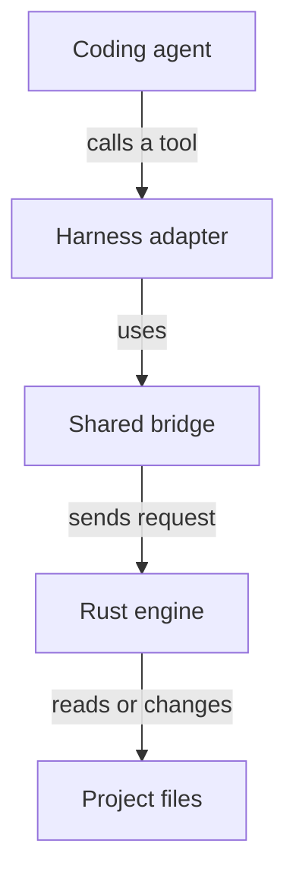
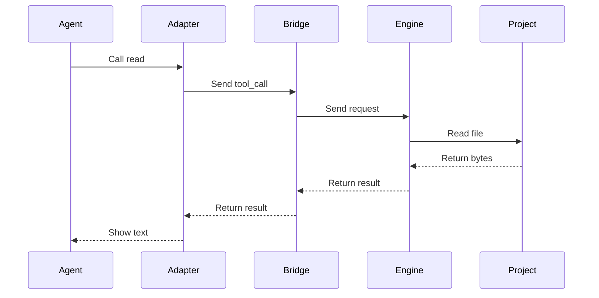
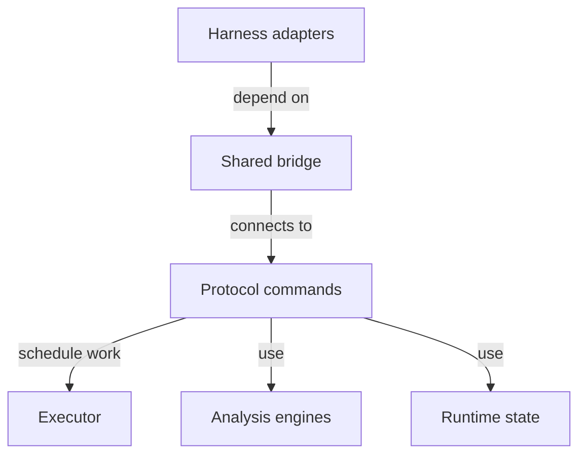
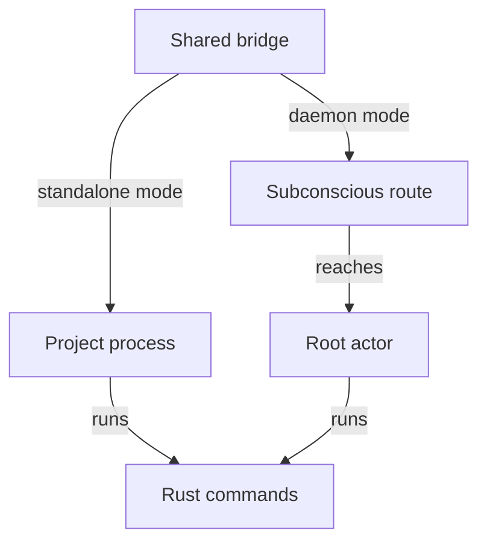
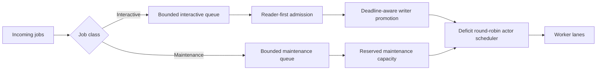
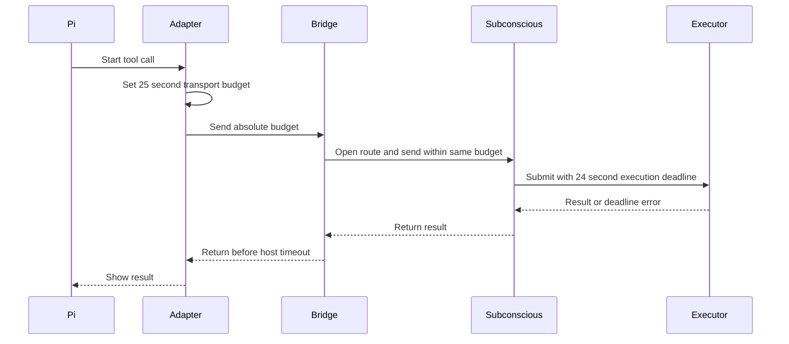
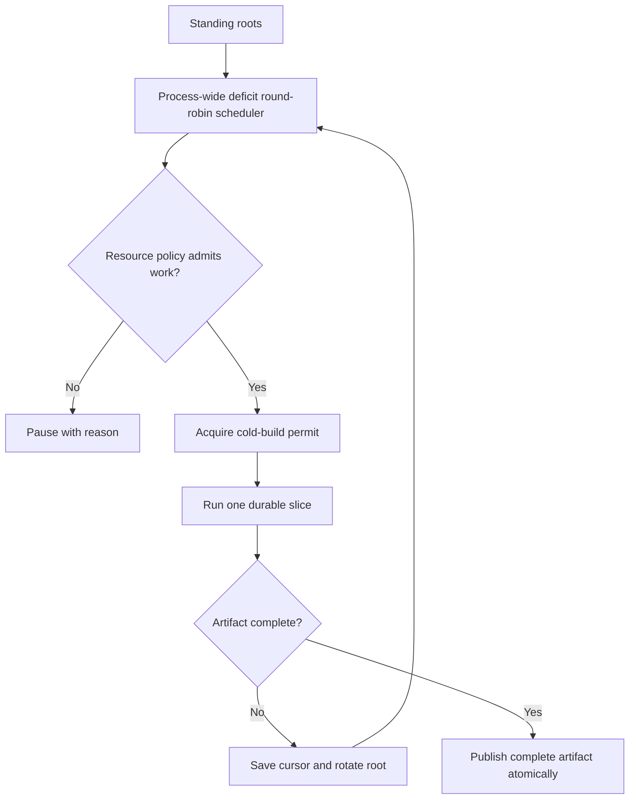
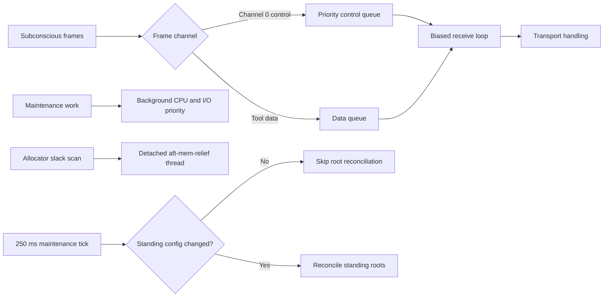

# ELI5: Architecture for New Contributors

AFT gives coding agents precise tools for reading, changing, and checking code.

This explanation follows one tool call from the agent to the Rust engine and back.

## What it is

**Analogy:** AFT is a workshop with reception desks, a courier, and one shared machine room.

The diagram shows the main path between an agent and a project.

A harness adapter connects one coding agent to AFT. The Rust engine owns the real tool behavior.

This split keeps each harness adapter small. It also gives every harness the same results.

## How a tool call works

The diagram shows one `read` request and its response.

1. The agent calls a tool registered by its harness adapter.
1. The adapter sends a common `tool_call` request through the shared bridge.
1. The bridge uses a standalone process or the Subconscious daemon transport.
1. The Rust engine validates the request and executes the command.
1. The result returns through the same layers to the agent.

The tool protocol defines the shared request and response format. New harnesses reuse this protocol and the same engine.

## The main parts

The diagram shows the main code areas and their dependencies.

| Part | Purpose | Start Here |
| --- | --- | --- |
| Harness adapters | Register tools for OpenCode and Pi. | `packages/opencode-plugin/src/index.ts`, `packages/pi-plugin/src/index.ts` |
| Shared bridge | Select transport, manage processes, and carry requests. | `packages/aft-bridge/src/transport-factory.ts`, `packages/aft-bridge/src/transport.ts` |
| Protocol commands | Translate a tool name into Rust command logic. | `crates/aft/src/run_tool_call.rs`, `crates/aft/src/commands/` |
| Executor | Give interactive work priority over maintenance work. | `crates/aft/src/executor/mod.rs` |
| Analysis engines | Parse, search, inspect, format, and change code. | `crates/aft/src/search_index.rs`, `crates/aft/src/inspect/`, `crates/aft/src/edit.rs` |
| Runtime state | Store project state, caches, watchers, and language servers. | `crates/aft/src/context.rs` |
| Subconscious transport | Serve many project roots through one daemon connection. | `crates/aft/src/subc/mod.rs` |

## Two transport modes

The diagram shows both paths to the same Rust command layer.

Standalone mode keeps one AFT process for a project root. It uses newline-delimited JSON over standard input and output.

Daemon mode sends requests through Subconscious routes. A root actor owns the state for each active project root.

Both modes use the same command handlers. A feature should behave the same in both modes.

## How the executor protects tool calls

The daemon can serve many project roots at the same time. Each root has an actor. An actor keeps the state and queues for one project root.

The diagram shows how the executor classifies and schedules work.

The executor separates interactive jobs from maintenance jobs. Reads, writes, and language-server requests are interactive jobs. Index refreshes and watcher drains are maintenance jobs.

Each queue has a fixed capacity. The executor rejects excess work with a structured backpressure error. It does not allow an unbounded queue to consume memory.

The interactive queue normally admits readers before writers. A waiting writer moves forward as its deadline approaches. This rule prevents reader traffic from starving a mutation.

The actor scheduler uses deficit round-robin scheduling. This scheduling method gives each active root a service allowance. A root rotates to the queue tail after it uses that allowance.

The executor removes expired jobs before dispatch. It returns a deadline error without starting obsolete work. Cancellation and every other removal path release the exact queue capacity that the job used.

Start with `crates/aft/src/executor/mod.rs`. Read `crates/aft/src/executor/tests.rs` for the queue contracts.

## How a request keeps one time budget

Pi stops a synchronous tool call after 30 seconds. AFT keeps its own deadlines below that host limit.

The diagram shows one budget across all transport stages.

The Pi adapter allows at most 25 seconds for synchronous transport. The Rust engine receives at most 24 seconds for interactive execution. The difference leaves time to encode and return the result before the host stops the call.

The bridge does not restart the budget when it opens a route. Route discovery, request dispatch, queue waiting, execution, and response delivery consume the same absolute budget.

The Pi adapter sends a progress update every five seconds while a tool runs. A progress update informs the user. It does not extend the host deadline.

A long `bash` request becomes a background task before the synchronous budget expires. The agent can inspect the task later. AFT does not lose the running process when the foreground wait ends.

Start with `packages/pi-plugin/src/tools/_shared.ts`, `packages/aft-bridge/src/subc-transport.ts`, and `crates/aft/src/subc/mod.rs`.

## How standing roots share index capacity

A standing root is a project that AFT indexes before an agent asks for it. Many standing roots must share a small amount of background capacity.

The diagram shows fair, resumable index construction.

The scheduler runs one bounded slice for a root. It charges the measured slice cost to that root. An unfinished root then rotates to the queue tail.

Search, semantic, and call-graph builders store durable cursors. A later slice resumes from the cursor. A restart or a scheduler rotation does not discard completed stages.

Readers continue to use the old published artifact during a rebuild. The builder publishes the replacement only after the full corpus is complete.

The `balanced` resource policy pauses new slices during battery saving or CPU, memory, and input/output pressure. It uses hysteresis so short signal changes do not repeatedly stop and start work. The `performance` policy ignores these pressure signals. Both policies keep the concurrency limit and fair rotation.

Start with `crates/aft/src/standing_scheduler.rs`, `crates/aft/src/resource_policy.rs`, and `crates/aft/src/subc/standing.rs`.

## How the daemon stays responsive

The transport thread must answer control traffic even when background indexing uses the machine.

The diagram shows the safeguards around the transport loop.

Channel 0 carries heartbeats and health checks. The daemon keeps control frames in a separate queue. A biased receive operation processes a ready control frame before buffered data frames.

Maintenance workers use background CPU and input/output priority. This rule reduces competition with transport and interactive worker threads.

Allocator inspection can pause inside the system allocator. AFT runs this scan on a detached `aft-mem-relief` thread. The transport tick only checks whether the scan is due.

Standing-root reconciliation can open SQLite and resolve paths. The standing actor caches a reconciliation key made from `storage_dir` and `index.roots`. An unchanged key makes the 250 millisecond maintenance tick skip that work. A change to only `index.resource_policy` does not require root reconciliation.

Start with `crates/aft/src/subc/mod.rs`, `crates/aft/src/thread_priority.rs`, `crates/aft/src/memory.rs`, and `crates/aft/src/subc/standing.rs`.

## Where new work belongs

Use the narrowest existing layer that owns the behavior.

| Change | Primary Location |
| --- | --- |
| Add a new agent tool | `crates/aft/src/commands/` and both harness tool directories |
| Change request translation | `crates/aft/src/subc_translate.rs` |
| Change agent-facing result text | `crates/aft/src/subc_format.rs` |
| Change transport behavior | `packages/aft-bridge/src/` |
| Change queue priority or admission | `crates/aft/src/executor/` |
| Change search behavior | `crates/aft/src/search_index.rs` or `crates/aft/src/grep_executor.rs` |
| Change health analysis | `crates/aft/src/inspect/` |
| Change shared runtime state | `crates/aft/src/context.rs` |

A command usually needs a Rust handler and one definition in each harness adapter.

Keep protocol dispatch thin. Put reusable behavior in a shared Rust engine outside `commands/`.

## Why it matters

The architecture separates the harness integration from the code analysis. Harness details cannot change the core behavior.

The persistent Rust engine keeps the indexes and the project state ready. The executor protects interactive requests from maintenance work.

## Words

| Word | What It Means |
| --- | --- |
| Absolute budget | One deadline that all transport and execution stages share. |
| Adapter | TypeScript code that connects a coding harness to AFT. |
| Bridge | Shared TypeScript code that carries requests to the Rust engine. |
| Command handler | Rust code that executes one protocol command. |
| Deficit round-robin | A fair scheduler that gives each active item a service allowance. |
| Durable slice | A bounded unit of index work that records a cursor for later resumption. |
| Executor | The scheduler that orders interactive and maintenance work. |
| Harness | A coding-agent host such as OpenCode or Pi. |
| Hysteresis | Separate pause and resume thresholds that prevent rapid state changes. |
| Newline-delimited JSON | One JSON message on each text line. |
| Reconciliation key | The configuration inputs that determine whether standing roots need reconciliation. |
| Root actor | The daemon state and queue for one project root. |
| Standing root | A configured project that AFT indexes before an interactive request. |
| Subconscious | The daemon transport that routes messages between modules. |
| Tool protocol | The shared request and response format used by each AFT transport. |
| Transport | The connection that carries a request and its response. |

## Where to look next

- [Architecture](../ARCHITECTURE.md) gives the complete system layer and data-flow map.
- [Codebase Structure](../STRUCTURE.md) maps each capability to its source directory.
- [Tool Reference](tools.md) describes every agent-facing tool.
- [Configuration Reference](config.md) describes runtime configuration.
